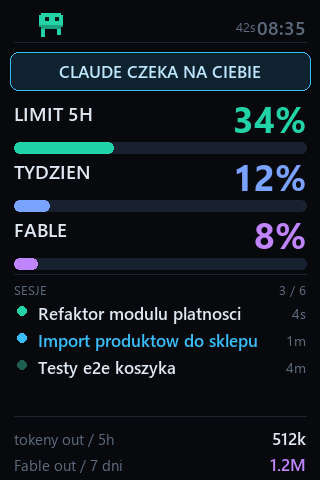

# Claude Panel

A desk-side usage monitor for [Claude Code](https://claude.com/claude-code):
your rate limits, active sessions and token burn — on a cheap 3.5" USB screen
next to your keyboard, and in the browser.

A tiny pixel mascot lives in the header: it sleeps when nothing is running,
walks (then runs, kicking up dust) as your token burn rate rises, sweats when
a limit passes 85%, and flashes a blue "!" bubble when a session is waiting
for your decision.

> UI is switchable **English/Polish** — a PL/EN toggle in the browser
> dashboard, `--lang en` for the screen. Docs in Polish:
> [docs/README.pl.md](docs/README.pl.md) (includes the full list of hardware
> gotchas we hit while building this).

<p align="center"></p>

## What it shows

- **Official rate limits** — the 5-hour window, the weekly limit and the
  per-model weekly limit (if your plan has one), in percent with reset
  countdowns. These come from the same endpoint the Claude Code client uses —
  no estimating.
- **Active sessions by name** — your custom session titles (or AI-generated
  ones), with a blinking status dot: green = working, steady dim = finished,
  blue = **waiting for your input** (requires hooks, see below).
- **Token counters** — output tokens in the current 5-hour window and for the
  scoped model over 7 days, computed locally from your transcripts.

Everything runs locally. Your OAuth token is read from your own
`~/.claude/.credentials.json` (macOS: from the Keychain, where Claude Code
stores it — the first read pops a system prompt, click "Always Allow" for
node) at request time, is never stored or logged, and is only ever sent to
`api.anthropic.com` — the panel plugs into *your* Claude automatically
because it reads *your* machine's Claude Code data.

## Hardware

Any **Turing Smart Screen 3.5"** or "USBMonitor" clone (USB ID `1A86:5722`,
sold on AliExpress/Temu as "3.5 inch USB screen AIDA64", ~$10–15). It shows up
as a serial port, not a display — this project speaks its protocol directly
(rev A, 320×480 portrait), based on
[turing-smart-screen-python](https://github.com/mathoudebine/turing-smart-screen-python).

👉 **The exact screen I use is this one on Temu: https://temu.to/k/ezbo6d0qn7j**
*(affiliate link — same price for you, small kickback for me. Any `1A86:5722`
clone works just as well.)*

**No screen? The browser dashboard works on its own** — just run the server
and open `http://127.0.0.1:4747`.

## Requirements

- Windows 10/11 or macOS
- [Claude Code](https://claude.com/claude-code) installed and logged in
  (subscription/OAuth login; the limits gauges need `~/.claude/.credentials.json`)
- Node.js 18+
- Python: on Windows, Python 3.10+ with `Pillow` and `pyserial`
  (`pip install Pillow pyserial`); on macOS, [uv](https://docs.astral.sh/uv/)
  is enough — it resolves both packages automatically (plain `python3` + pip
  works too)

## Install

Windows:

```bat
git clone https://github.com/KonradLe/claude-panel.git
cd claude-panel
install.bat
```

macOS:

```sh
git clone https://github.com/KonradLe/claude-panel.git
cd claude-panel
./install.sh
```

The installer checks Node/Python, installs the Python packages (skipped with
uv), offers to add the panel to autostart (Windows Startup folder / macOS
launchd) and starts it. That's the whole setup.

On macOS the CH340 serial driver for the screen is built into the system —
nothing extra to install.

**The USB screen can be plugged in at any time** — before or after install.
It's auto-detected by its hardware signature and reconnects by itself after
being unplugged (the loop retries in the background). The browser dashboard
works without the screen at all.

## Manual start

Windows:

```bat
:: 1. data server + browser dashboard
node server.js
:: -> http://127.0.0.1:4747

:: 2. (optional) the USB screen, auto-detected by hardware signature
python render.py --serial AUTO
```

macOS (or `./start.sh` for both at once):

```sh
# 1. data server + browser dashboard
node server.js
# -> http://127.0.0.1:4747

# 2. (optional) the USB screen, auto-detected by hardware signature
uv run render.py --serial AUTO      # or: python3 render.py --serial AUTO
```

### Autostart (Windows)

`install.bat` sets this up for you. By hand: create a shortcut to
`panel-start.vbs` in `shell:startup`. It launches both supervisor scripts
(`run-server.bat`, `run-screen.bat`) hidden; each restarts its process 5 s
after a crash.

### Autostart (macOS)

`install.sh` sets this up for you: two launchd agents
(`com.claude-panel.server` / `com.claude-panel.screen` in
`~/Library/LaunchAgents`) with `KeepAlive` — launchd itself restarts either
process 5 s after a crash, logs land in `logs/`. Remove with:

```sh
launchctl unload ~/Library/LaunchAgents/com.claude-panel.*.plist
rm ~/Library/LaunchAgents/com.claude-panel.*.plist
```

**To stop the screen loop, create a `stop.flag` file in the project folder** —
never kill the python process mid-transmission (a hard kill can desync the
screen's command parser; the loop resyncs on reconnect, but the flag is clean).

## Configuration

| Env var | Default | Meaning |
|---|---|---|
| `PANEL_PORT` | `4747` | HTTP port |
| `PANEL_BIND` | `127.0.0.1` | set `0.0.0.0` to allow LAN access (e.g. a wall tablet) — note the API exposes session titles and accepts unauthenticated hook POSTs |
| `PANEL_USAGE_POLL_MS` | `120000` | how often to poll the usage API (429-backoff built in) |
| `PANEL_NO_API` | – | set `1` to skip the API and rely on Claude Code's cached limits only |

`render.py` flags: `--serial AUTO|COMx`, `--interval` (data refresh, s),
`--tick` (mascot animation step, s), `--brightness 0-100`,
`--lang pl|en` (screen language, also via `PANEL_LANG`).

The browser dashboard has its own PL/EN toggle in the header (persisted in
localStorage).

## "Waiting for you" alerts (optional)

The blue state needs Claude Code hooks. Add to `~/.claude/settings.json`
(one entry per event: `Notification`, `Stop`, `UserPromptSubmit`):

```json
"hooks": {
  "Notification": [
    { "hooks": [ { "type": "command", "command": "curl.exe -s -m 2 -X POST -H \"Content-Type: application/json\" --data-binary @- http://127.0.0.1:4747/api/hook" } ] }
  ]
}
```

`-m 2` matters: if the panel is down, curl gives up after 2 s instead of
blocking Claude Code. On macOS/Linux use `curl` instead of `curl.exe`.

## How it works

- `server.js` — no-dependency Node server. Incrementally tails
  `~/.claude/projects/**/*.jsonl` for per-message token usage and session
  titles, polls the usage endpoint (with exponential backoff on 429 and an
  on-disk cache so values never travel backwards), serves `/api/state`.
- `render.py` — draws a 320×480 frame with Pillow and sends **only changed
  rectangles** over serial (a typical update is ~200 bytes vs 307 KB for a
  full frame). The mascot and blinking dots are tiny partial updates between
  data refreshes.
- `turing.py` — minimal rev-A protocol driver: 64 KB write chunks (small
  chunks die on per-write USB overhead), `write_timeout` so a hung screen
  can't freeze the loop, and a parser resync on connect.

Hard-won implementation notes (Polish): [docs/README.pl.md](docs/README.pl.md).

## License

MIT
